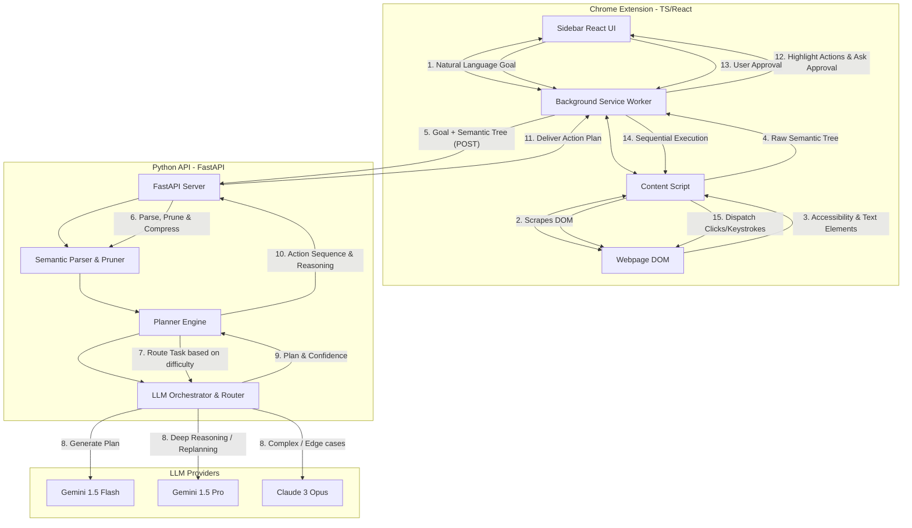
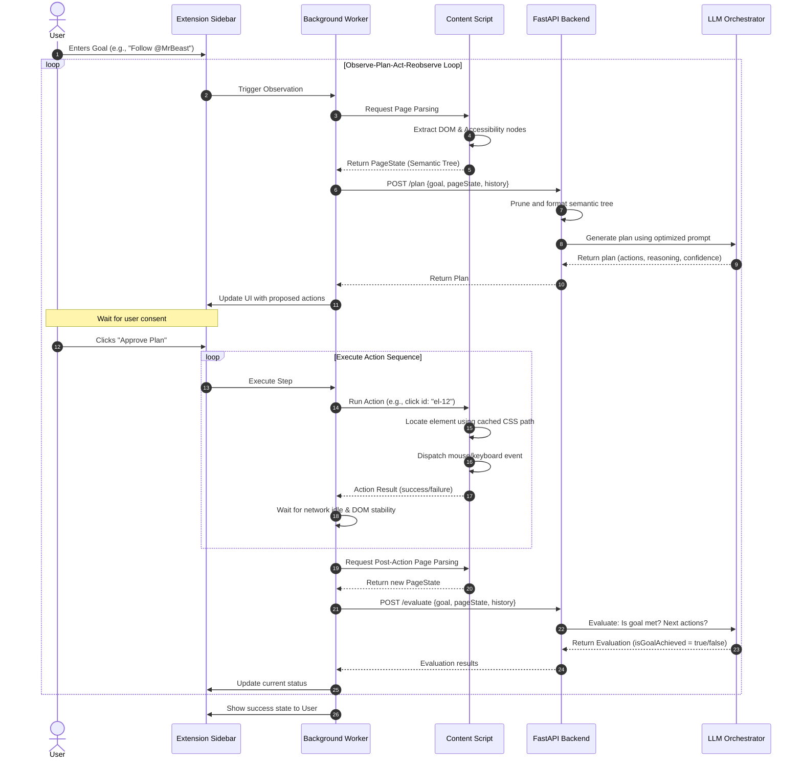
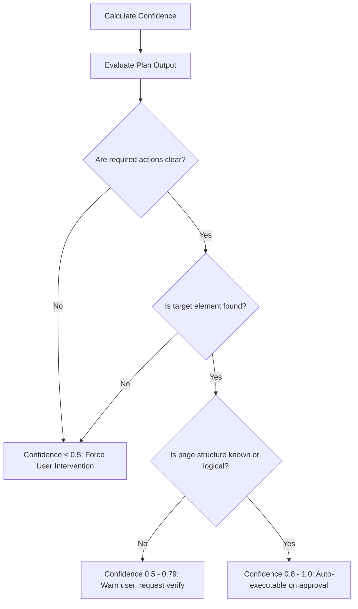

# Flowly: AI Social Media Browser Agent

Flowly is a generalized browser agent designed to navigate and execute natural language tasks on any social media interface. By utilizing a semantic model of the page instead of hardcoded CSS/XPath selectors, it generalizes to unseen websites and adapts to UI changes.

This repository contains the architecture, schemas, and roadmap for this project.

---

## 1. MVP Architecture

Flowly uses a **Client-Server Architecture** to keep the browser extension lightweight, modular, and easy to debug. The system is split into two primary components:
1. **Frontend (Chrome Extension)**: Runs in the user's browser, performs DOM scraping, renders interactive UI overlays, and executes actions.
2. **Backend (Python FastAPI)**: Handles page state processing, LLM orchestration, planning logic, and prompt generation.



### Components Description

*   **Vite + React Sidebar UI**: Injected iframe or sidebar panel. Displays the user's goal input, showing the proposed step-by-step action plan, confidence metrics, and a "Run Plan" approval button.
*   **Background Service Worker (`background.ts`)**: The central communication hub. Manages connection ports between the sidebar, content scripts, and the Python backend. Handles API authorization, extension state, and session tracking.
*   **Content Script (`content.ts`)**: Operates directly on the webpage context. Responsible for traversing the DOM to extract interactive semantic nodes and executing actual mouse/keyboard simulation events on chosen selectors.
*   **FastAPI Backend**: Exposes endpoints for planning and state evaluation. The backend does not run a browser itself during normal extension operation, keeping resource consumption minimal.
*   **Playwright Automation Driver (Optional Backend Track)**: A secondary interface in the backend. Allows headless automated integration testing by simulating browser windows and connecting directly to the same Python Agent loop, making testing highly scriptable.

---

## 2. Folder Structure

A monorepo structure is recommended. It cleanly separates the TypeScript Chrome Extension from the Python FastAPI backend, allowing individual compilation and testing.

```text
flowly/
├── extension/                  # Chrome Extension (React + TS + Vite)
│   ├── public/                 # Extension Assets & Manifest
│   │   ├── manifest.json       # Chrome Manifest V3 configuration
│   │   └── icon.png
│   ├── src/
│   │   ├── background/         # Chrome background service worker
│   │   │   └── background.ts   # Routes requests to Backend API
│   │   ├── content/            # Injected page scripts
│   │   │   ├── parser/         # DOM traversal & Accessibility parsing
│   │   │   │   └── accessibilityTree.ts
│   │   │   ├── executor/       # Click, scroll, & keyboard action simulators
│   │   │   │   └── elementActions.ts
│   │   │   └── content.ts      # Content script entry point
│   │   ├── sidebar/            # Extension Panel React App
│   │   │   ├── components/     # Planning UI, buttons, and state indicators
│   │   │   │   ├── ActionPlanner.tsx
│   │   │   │   └── ConfidenceBadge.tsx
│   │   │   ├── App.tsx
│   │   │   └── main.tsx
│   │   └── shared/             # TS types
│   │       └── types.ts
│   ├── package.json
│   ├── tsconfig.json
│   └── vite.config.ts
├── backend/                    # Python Backend API & Agent Loop
│   ├── app/
│   │   ├── agent/
│   │   │   ├── __init__.py
│   │   │   ├── planner.py      # Core agent execution & planning logic
│   │   │   ├── router.py       # Cost-effective LLM routing logic
│   │   │   └── parser.py       # Cleans, filters, and token-optimizes trees
│   │   ├── prompts/
│   │   │   ├── __init__.py
│   │   │   ├── planner_system.txt
│   │   │   └── critic_system.txt
│   │   ├── schemas/            # Pydantic validation schemas
│   │   │   └── schemas.py
│   │   ├── main.py             # FastAPI Server entry point
│   │   └── config.py           # Environment, credentials, API keys
│   ├── tests/                  # Backend unit, integration, and prompt tests
│   │   ├── test_planner.py
│   │   └── test_parser.py
│   ├── requirements.txt
│   └── Dockerfile
└── README.md
```

---

## 3. Data Structures

The system relies on strong typing and validation boundaries (TypeScript interface matched to Python Pydantic models) to ensure consistent data structures.

### Key Types

#### A. Semantic Element Node
Every interactive or contextual element on the webpage is mapped to a standard node format.

```typescript
export interface SemanticNode {
  id: string;             // Ephemeral, sequential ID (e.g., "el-24") generated per page load
  type: 'button' | 'link' | 'textbox' | 'checkbox' | 'dropdown' | 'container' | 'text';
  text: string;           // Visible text, fallback to aria-label or placeholder
  placeholder?: string;   // Input placeholder text if applicable
  ariaLabel?: string;     // Accessibility labels
  disabled: boolean;      // Disabled element status
  checked?: boolean;      // For checkboxes/radios
  parentId?: string;      // ID of the logical container (e.g., a card or comment block)
  
  // Extension-only properties (stripped before sending to LLM to save tokens)
  selector?: string;      // CSS selector or structural path used by content script for execution
  rect?: {                // Viewport position for scrolling or validation overlays
    x: number;
    y: number;
    width: number;
    height: number;
  };
}
```

#### B. Page State
Represents the structural description of the active tab.

```typescript
export interface PageState {
  url: string;
  title: string;
  elements: SemanticNode[];
  viewport: {
    width: number;
    height: number;
    scrollY: number;
  };
}
```

#### C. Primitive Action Space
To ensure execution stability, actions are strictly constrained.

```typescript
export type ActionType = 'click' | 'type' | 'scroll' | 'wait' | 'navigate';

export interface Action {
  type: ActionType;
  elementId?: string;     // Target element (required for click, type)
  value?: string;         // Input text for 'type', URL for 'navigate', scroll direction/pixel-count for 'scroll'
  waitMs?: number;        // Wait duration in milliseconds (for 'wait')
  reasoning: string;      // LLM's rationale for performing this action
}
```

#### D. Agent Plan
The plan generated by the LLM and presented to the user.

```typescript
export interface ActionPlan {
  goal: string;
  steps: Action[];
  reasoning: string;
  confidence: number;       // Score from 0.0 to 1.0
  isGoalAchieved: boolean;  // Indicator if current page reflects the goal being completed
}
```

---

## 4. Execution Loop (Observe → Plan → Act → Reobserve)

The execution loop ensures the agent reacts dynamically to page transitions, ajax-loading states, and error codes.



### Execution Loop Pseudocode (Backend Controller)

```python
class AgentController:
    def __init__(self, max_depth: int = 2, max_pages: int = 5):
        self.max_depth = max_depth
        self.max_pages = max_pages
        self.history = []

    async def get_next_step(self, goal: str, current_page: PageState) -> ActionPlan:
        # Check termination constraints
        if len(self.history) >= self.max_depth:
            return ActionPlan(
                goal=goal,
                steps=[],
                reasoning="Maximum execution depth reached. Aborting to prevent loop.",
                confidence=0.0,
                isGoalAchieved=False
            )
            
        # Select appropriate model based on complexity and history length
        model = self.route_model(goal, current_page)
        
        # Build prompt and execute planner
        plan = await run_llm_planner(model, goal, current_page, self.history)
        return plan

    def route_model(self, goal: str, page: PageState) -> str:
        # If there's an error in history, route to Gemini 1.5 Pro for correction
        if any(h.get('failed') for h in self.history):
            return "gemini-1.5-pro"
        # Standard routine actions use the highly fast/cheap Gemini 1.5 Flash
        return "gemini-1.5-flash"
```

---

## 5. Planner Prompts

The prompt is structured to force the planner to use **Chain of Thought (CoT)** reasoning before producing the final JSON list of actions.

### System Prompt (`planner_system.txt`)

```text
You are Flowly, an intelligent AI browser agent navigating social media platforms.
Your goal is to execute the user's instructions on the current page.

### Strict Constraints:
1. Avoid assumptions. Rely ONLY on the semantic tree provided.
2. Select actions strictly from the supported list: Click, Type, Scroll, Wait, Navigate.
3. Every step MUST include clear reasoning.
4. Output your plan inside the designated JSON schema containing steps, reasoning, confidence, and isGoalAchieved.
5. If the goal is fully achieved, return empty steps and set isGoalAchieved = true.

### Available Actions:
- Click(elementId): Click an element. Use for buttons, interactive links, checkable inputs.
- Type(elementId, value): Focuses the element and types the specified value. Use for input textboxes.
- Scroll(value): Value must be 'up' or 'down'. Scrolls the current viewport.
- Wait(waitMs): Wait for UI or network responses.
- Navigate(value): Navigates to a specific URL (only if a button action isn't available).

### Element Reference format:
In the semantic representation, each element is denoted by an ID like [el-15]. Use this exact ID in your actions.
```

### Execution Prompt (User Prompt Template)

```text
### Goal
Goal: {goal}

### Execution History
{history_formatted}

### Current Page State
URL: {url}
Title: {title}

### Page Semantic Tree
{semantic_tree}

---
Analyze the page, identify structural patterns (like lists, comment threads, post boxes), and formulate your plan. 
Provide a confidence score reflecting how sure you are that these actions will advance or fulfill the goal.
```

---

## 6. Semantic Page Representation

To stay well within rate limits and ensure low latency, raw HTML is never sent to the LLM. Instead, Flowly builds a highly dense semantic tree.

### 1. Element Filtering (Noise Reduction)
Before compilation, the extension prunes the DOM tree:
*   **Visibility Filtering**: Exclude elements with `display: none`, `visibility: hidden`, `opacity: 0`, or dimensions of `0x0`.
*   **Role/Aria Mapping**: Identify elements with explicit HTML roles (`<button>`, `<input>`, `<a>`) or aria attributes (`role="button"`, `aria-label`).
*   **Semantic Merging**: Merge redundant wrappers. For instance, a `<div>` wrapping an `<svg>` and a text node "Follow" is flattened into a single logical "button" with text content "Follow".
*   **List Pruning**: If a feed contains dozens of posts, only extract the first 3-5 items to limit token load.

### 2. Output Formatting (Token Optimization)
Instead of sending verbose JSON, the backend formats the tree as a YAML-like tree structure, saving **up to 70% in tokens**.

#### JSON Form (Extension Internal representation)
```json
[
  {"id": "el-0", "type": "container", "text": "Post Feed"},
  {"id": "el-1", "type": "container", "text": "User Card Post by MrBeast", "parentId": "el-0"},
  {"id": "el-2", "type": "link", "text": "@MrBeast", "parentId": "el-1"},
  {"id": "el-3", "type": "button", "text": "Subscribe", "parentId": "el-1"}
]
```

#### Compact Token-Optimized String (Sent to LLM)
```yaml
[el-0] Container (Post Feed)
  [el-1] Container (User Card Post by MrBeast)
    [el-2] Link "@MrBeast"
    [el-3] Button "Subscribe"
```

---

## 7. Confidence Scoring

Confidence scoring acts as a critical safety valve, preventing unpredictable actions on unknown page states.



### Metric Breakdown

| Score Range | Category | Action Pipeline | Indicators |
| :--- | :--- | :--- | :--- |
| **0.80 - 1.00** | **High** | Direct execution upon approval. | Clear semantic match (e.g. click "Follow" button directly on profile header). |
| **0.50 - 0.79** | **Medium** | Display warning in sidebar, highlight target elements visually. | Ambiguity present (e.g., multiple search results; scrolling required; indirect text match). |
| **0.00 - 0.49** | **Low** | Block execution, ask user to manually select or rephrase. | No obvious buttons match, page layout highly unstructured, repetitive action failure. |

### Logic Implementation
The LLM evaluates its own output confidence, but the backend overrides it using programmatic rules:
1. **Fallback Penalty**: If the agent must use navigation coordinates or raw text searches because interactive elements aren't tagged, subtract `0.2` from confidence.
2. **History Penalty**: If the same action has been attempted twice in history, reduce confidence to `0.3` and set `requiresHumanHelp = true`.

---

## 8. Recovery Mechanisms

Standard social media platforms update their class names weekly (e.g., CSS obfuscation like `class="css-1dbjc4n"`). Flowly avoids hardcoded references using several recovery paths:

### 1. Element Drift Matching
When a page updates dynamically, element positions and transient IDs may change. The extension content script uses a multi-faceted locator:
*   **Primary Locator**: Match by structural semantic role and text content (e.g., "Find button with text 'Like' inside the same container as text '@username'").
*   **Secondary Locator**: Target element relative position (index offset).
*   **Fallback Locator**: Fuzzy string search on DOM attributes (e.g., text matching 80%+ similarity).

### 2. State-Based Backtracking
If an action results in an unexpected state (e.g., clicking an image loads an full-screen lightbox that obscures buttons):
*   The planner detects that elements from the previous page are gone and the goal isn't closer.
*   The backend triggers a virtual `Backtrack` action, simulating a keypress of the `Escape` key or calling `history.back()`.

### 3. Dynamic Wait Conditions
Instead of hardcoded sleep times, the content script observes page state changes:
*   **DOM Mutation Observers**: Watches for loading indicators (spinners, skeletons) to disappear.
*   **Network Activity Monitor**: Background script monitors API request activity and delays planning until active connections settle.

---

## 9. Development Roadmap

A structured 14-week timeline optimized for a student project lifecycle, ensuring a functional MVP by mid-term and generalization tests for the final.

```yaml
Milestone 1: Foundations & Parser (Weeks 1-3)
  - Set up manifest V3 chrome extension boilerplate.
  - Implement content script DOM traversal.
  - Export custom parsed accessibility/semantic tree JSON.

Milestone 2: Backend & LLM Pipeline (Weeks 4-6)
  - Implement FastAPI endpoints.
  - Integrate Gemini API.
  - Set up parser & token compression logic.
  - Set up prompts and verify JSON schemas.

Milestone 3: UI & Action Executor (Weeks 7-9)
  - Build React Sidebar.
  - Build execution engine (simulated click/type).
  - Connect client approval request to backend output.

Milestone 4: Safety & Edge Cases (Weeks 10-11)
  - Implement confidence rating and human-in-the-loop fallback UI.
  - Write test cases for Instagram, Reddit, and YouTube.
  - Verify stability on 3 previously unseen platforms.

Milestone 5: Generalization & Polish (Weeks 12-14)
  - Implement backtracking and adaptive element locators.
  - Run evaluation suite measuring accuracy.
  - Final packaging & documentation.
```

---

## 10. Example JSON Schemas

These structural JSON schemas govern API message payloads.

### 1. Page State Input (Sent from Extension to Backend `/api/plan`)
```json
{
  "$schema": "https://json-schema.org/draft/2020-12/schema",
  "title": "PageStateRequest",
  "type": "object",
  "properties": {
    "goal": {
      "type": "string",
      "description": "User's goal in natural language"
    },
    "url": {
      "type": "string",
      "format": "uri"
    },
    "elements": {
      "type": "array",
      "items": {
        "type": "object",
        "properties": {
          "id": { "type": "string" },
          "type": { "type": "string", "enum": ["button", "link", "textbox", "checkbox", "dropdown", "container", "text"] },
          "text": { "type": "string" },
          "placeholder": { "type": "string" },
          "ariaLabel": { "type": "string" },
          "disabled": { "type": "boolean" },
          "checked": { "type": "boolean" },
          "parentId": { "type": "string" }
        },
        "required": ["id", "type", "text", "disabled"]
      }
    },
    "history": {
      "type": "array",
      "items": {
        "type": "object",
        "properties": {
          "action": { "type": "string" },
          "status": { "type": "string", "enum": ["success", "failed"] },
          "error": { "type": "string" }
        },
        "required": ["action", "status"]
      }
    }
  },
  "required": ["goal", "url", "elements", "history"]
}
```

### 2. Planner Action Response (Sent from Backend to Extension)
```json
{
  "$schema": "https://json-schema.org/draft/2020-12/schema",
  "title": "ActionPlanResponse",
  "type": "object",
  "properties": {
    "reasoning": {
      "type": "string",
      "description": "Explanation of the strategic plan and how the chosen actions lead to the goal"
    },
    "confidence": {
      "type": "number",
      "minimum": 0.0,
      "maximum": 1.0
    },
    "isGoalAchieved": {
      "type": "boolean",
      "description": "True if the planner determines the goal has been satisfied by the current state"
    },
    "steps": {
      "type": "array",
      "items": {
        "type": "object",
        "properties": {
          "type": { "type": "string", "enum": ["click", "type", "scroll", "wait", "navigate"] },
          "elementId": { "type": "string" },
          "value": { "type": "string" },
          "waitMs": { "type": "integer" },
          "reasoning": { "type": "string" }
        },
        "required": ["type", "reasoning"]
      }
    }
  },
  "required": ["reasoning", "confidence", "isGoalAchieved", "steps"]
}
```
